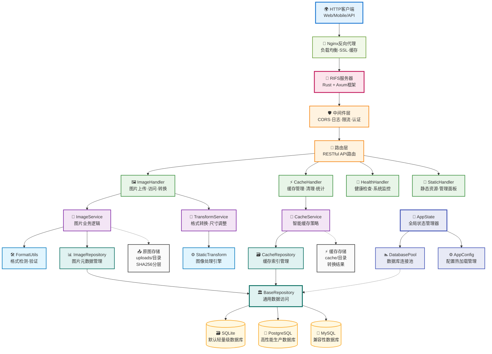

# RIFS - Rust图床服务

<div align="center">


<p>
  
  
  
  
</p>

**🚀 高性能 Rust 图床服务 • 支持实时转换和智能缓存**

</div>

---

## ⚠️ 重要声明

<div align="center">

**🤖 本项目完全由 AI (Claude) 生成和编写 🤖**

**此项目包括所有代码、文档、配置文件等均为人工智能自动生成**  
**请在使用前仔细检查和测试，AI生成的代码可能存在潜在问题**  
**不建议直接用于生产环境，需要经过充分的测试和验证**

</div>

---

## ✨ 特性

- **高性能** - Rust编写，内存安全，高并发处理
- **多格式支持** - 支持JPEG、PNG、GIF、WebP、AVIF、ICO 6种主流图片格式
- **实时转换** - 通过URL参数进行图片尺寸、格式、质量转换
- **智能缓存** - 自动缓存转换结果，支持LRU清理策略
- **去重存储** - SHA256哈希去重，避免重复存储
- **管理面板** - 内置Web管理界面，支持缓存管理和系统监控

## 🏗️ 系统架构



## 🚀 快速开始

### 本地运行

```bash
# 克隆项目
git clone https://github.com/djkcyl/rifs.git
cd rifs

# 运行
cargo run --release
```

### Docker 运行

```bash
docker run --rm --pull always -d \
  -p 3000:3000 \
  -v ./uploads:/app/uploads \
  -v ./cache:/app/cache \
  -v ./data:/app/data \
  -v ./config.toml:/app/config.toml \
  djkcyl/rifs:latest
```

## 📖 使用示例

### 上传图片

```bash
curl -F "file=@image.jpg" http://localhost:3000/upload
```

### 图片访问

```bash
# 原图
http://localhost:3000/images/a1b2c3d4...

# 转换 - 宽度800px
http://localhost:3000/images/a1b2c3d4...@w800

# 复杂转换 - 尺寸+格式+质量
http://localhost:3000/images/a1b2c3d4...@w800_h600_jpeg_q90
```

### 转换参数

| 参数 | 说明 | 示例 |
|------|------|------|
| `w{数字}` | 最大宽度 | `w800` |
| `h{数字}` | 最大高度 | `h600` |
| `{格式}` | 目标格式 | `jpeg`, `png`, `webp`, `avif`, `ico` |
| `q{数字}` | 质量1-100 | `q90` |
| `na[w/b/#hex]` | 去透明+背景色 | `naw`(白), `nab`(黑), `na#ff0000` |

## ⚙️ 配置

首次运行时会自动创建 `config.toml` 配置文件，包含所有配置项的详细说明。修改配置后重启服务即可生效。

也可以通过环境变量覆盖配置，格式为 `RIFS_` 前缀，如：
```bash
export RIFS_SERVER_PORT=8080
```

## 📊 管理面板

- **API文档**: http://localhost:3000/
- **缓存管理**: http://localhost:3000/cache/management

## 🖼️ 支持格式

| 格式 | 扩展名 | 读取 | 写入 | URL转换 | 质量控制 |
|------|--------|------|------|---------|----------|
| **JPEG** | .jpg, .jpeg | ✅ | ✅ | ✅ | ✅ |
| **PNG** | .png | ✅ | ✅ | ✅ | ✅ |
| **GIF** | .gif | ✅ | ✅ | ✅ | ❌ |
| **WebP** | .webp | ✅ | ✅ | ✅ | ✅ |
| **AVIF** | .avif | ✅ | ✅ | ✅ | ❌ |
| **ICO** | .ico | ✅ | ✅ | ✅ | ❌ |

### 转换能力说明

- ✅ **完全支持**: 可读取、写入、URL参数转换
- ❌ **仅存储**: 支持上传存储原图，不支持参数转换
- **动画处理**: GIF/WebP动画转换时自动提取第一帧
- **质量控制**: JPEG、PNG、WebP支持质量参数优化
- **智能压缩**: PNG根据质量参数智能选择压缩级别和滤波器

---

<div align="center">
Made with ❤️ and 🦀
</div> 